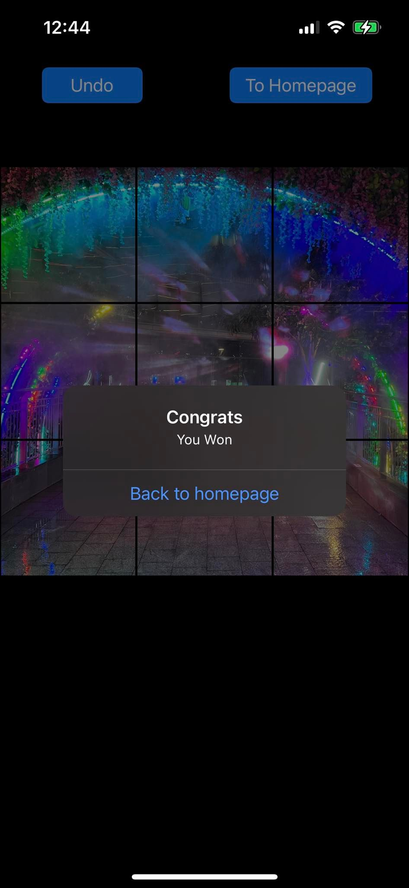

# SlidingPhotosIOS

## About

This is a sliding tiles game. One needs to slide tiles into empty slot in a correctly ordered manner to solve the puzzle. To slide a tile into the empty slot, one needs to press a tile next to the empty slot and the tile will simply slide to the empty slot.

Once the puzzle is solved and the puzzles are assembled in a way to look identical to the original picture, the empty slot will be filled with the last tile that was originally missing and complete the picture players intended to assemble as.

## Features
- One distinguishing feature of this game over other sliding tiles game is that any picture can be uploaded from one's album
- The game is divided into easy, medium, and hard level of difficulties as shown:        
- Easy difficulty divides the picture chosen into a 3 by 3 board by dividing the picture into 9 parts and make one of them empty.
- Medium difficulty divides the picture chosen into a 4 by 4 board by dividing the picture into 16 parts and make one of them empty.
- Hard difficulty divides the picture chosen into 5 by 5 board by dividing the picture into 25 parts and make one of them empty.

## Examples

<h3 align="center">
  
  
</h3>
